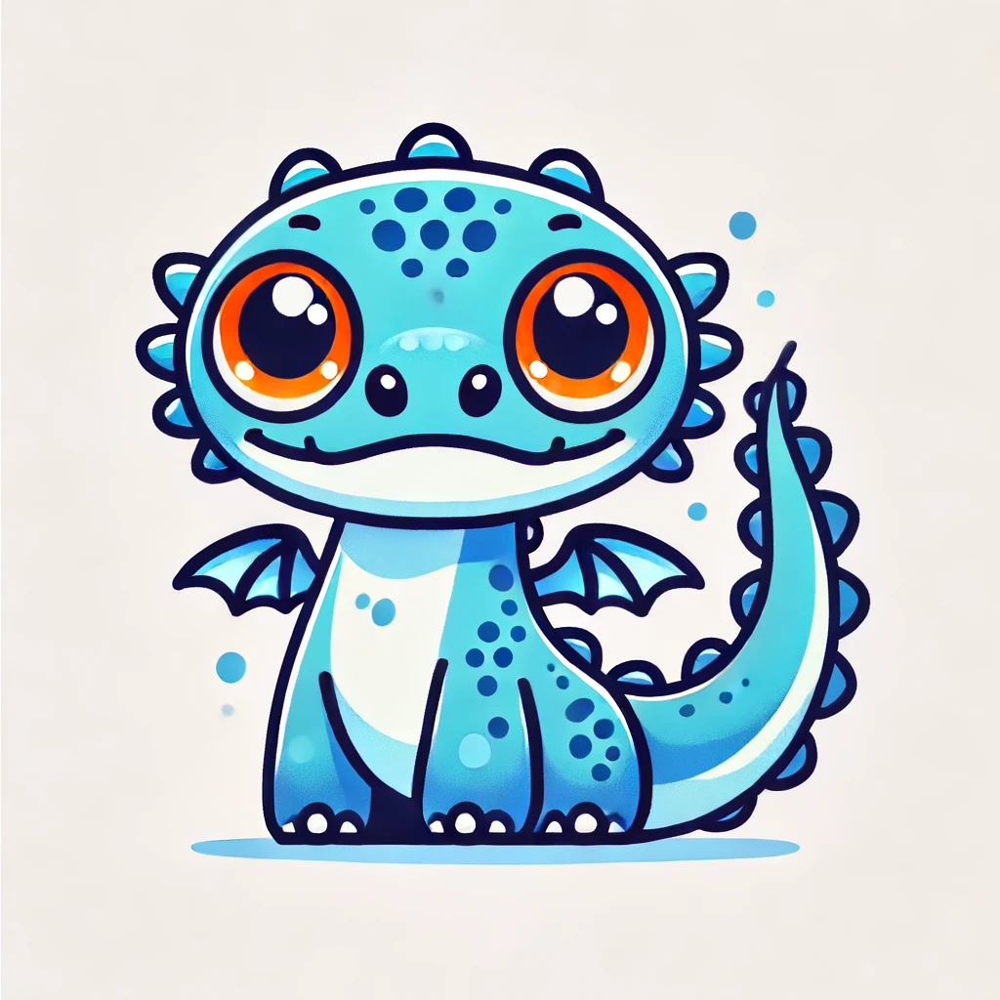

# Dino - Reactive UI Library


Dino is a lightweight, reactive UI library that allows developers to create interactive user interfaces with minimal overhead. It is based on the concept of reactive programming and provides a simple and intuitive API for building UI components.

## Why?
My main goal was to write a library inspired by SwiftUI (for Swift), allowing me to stay entirely within the JavaScript ecosystem without having to write HTML code again.

## Never ask yourself how to center a div again
In Dino, I have implemented custom components, including HStacks and VStacks, similar to those in SwiftUI. These components can be easily centered through their API, providing a more streamlined layout management.

## Example -  Counter App

Here's an example of a simple counter app built with Dino using components:

```typescript
<body></body>
<script src="https://cdn.tailwindcss.com"></script>
<script src="dist/bundle.umd.js"></script>
<script lang="ts">
    const { HtmlDocument, Reactive, h } = Dino;

    const Counter = () => {
      const reactiveData = new Reactive({
        count: 0
      });

      return (
        h.div()
          .addClass(["bg-gray-200", "p-4", "rounded"])
          .appendChild(
            h.h1()
            .bindTextContent('count', reactiveData)
            .setStyle({ fontSize: '3rem' })
            )
          .appendChild(
            h.div()
              .addClass(["flex", "justify-center", "mt-4"])
              .appendChild(
                h.button()
                  .addClass(["bg-blue-500", "text-white", "px-4", "py-2", "rounded", "mr-2"])
                  .setTextContent("Increment")
                  .onClick(() => reactiveData.count++)
              )
              .appendChild(
                h.button()
                  .addClass(["bg-red-500", "text-white", "px-4", "py-2", "rounded"])
                  .setTextContent("Decrement")
                  .onClick(() => reactiveData.count--)
              )
          )
      )
    }

    new HtmlDocument(Counter());
</script>
```
This example creates a simple counter app with two buttons: one to increment the count and one to decrement it. The count is stored in a Reactive object and is automatically updated in the UI when it changes.

## Example - Todo List
Here's an example of a todo list app built with Dino using components:

```typescript
<!doctype html>
<html lang="en">
  <head>
    <meta charset="UTF-8" />
    <meta name="viewport" content="width=device-width, initial-scale=1.0" />
    <title>Dino - Todo List</title>
  </head>
  <body>
    <script src="https://cdn.tailwindcss.com"></script>
    <script src="dist/bundle.umd.js"></script>
    <script lang="ts">
      const { HtmlDocument, Reactive, h } = Dino;

      const TodoItem = (props) => {
        const todo = props.todo;

        const taskItem = h
          .li()
          .addClass(['flex', 'items-center', 'mb-2'])
          .appendChild(
            h
              .input()
              .setType('checkbox')
              .bindChecked('completed', todo)
              .addClass(['mr-2'])
              .onInput(() => {
                todo.completed = !todo.completed;
              }),
          )
          .appendChild(
            h
              .span()
              .bindTextContent('text', todo)
              .addClass(
                todo.completed ? ['line-through', 'text-gray-500'] : [],
              ),
          );

        Reactive.effect(() => {
          todo.completed
            ? taskItem.addClass(['line-through', 'text-gray-500'])
            : taskItem.removeClass(['line-through', 'text-gray-500']);
        });

        return taskItem;
      };

      const TodoApp = () => {
        const reactiveData = new Reactive({
          todos: [],
          newTodo: '',
        });

        const addTodo = () => {
          if (reactiveData.newTodo.trim() !== '') {
            reactiveData.todos.push({
              text: reactiveData.newTodo,
              completed: false,
            });
            reactiveData.newTodo = '';
          }
        };

        return h
          .div()
          .addClass(['bg-gray-200', 'p-4', 'rounded'])
          .appendChild(
            h
              .h1()
              .setTextContent('Todo List')
              .setStyle({ fontSize: '2rem', marginBottom: '1rem' }),
          )
          .appendChild(
            h
              .div()
              .addClass(['flex'])
              .appendChild(
                h
                  .input()
                  .bindValue('newTodo', reactiveData)
                  .addClass(['flex-grow', 'mr-2', 'px-2', 'py-1', 'rounded'])
                  .onInput((e) => (reactiveData.newTodo = e.target.value)),
              )
              .appendChild(
                h
                  .button()
                  .addClass([
                    'bg-blue-500',
                    'text-white',
                    'px-4',
                    'py-2',
                    'rounded',
                  ])
                  .setTextContent('Add Todo')
                  .onClick(addTodo),
              ),
          )
          .appendChild(
            h
              .ul()
              .addClass(['mt-4'])
              .bindForEach('todos', reactiveData, (todo) => TodoItem({ todo })),
          );
      };

      new HtmlDocument(TodoApp());
    </script>
  </body>
</html>
```
This example creates a todo list app where users can add new todos, mark them as completed, and see a list of all their todos. The todo data is stored in a Reactive object and is automatically updated in the UI when it changes. The TodoItem component is used to render each individual todo item.

These examples demonstrate the power and simplicity of Dino for building reactive user interfaces using components. The library's reactive data binding and virtual DOM rendering make it easy to create interactive applications, while staying in the JS context and without having to worry about complex state management or manual DOM manipulation.